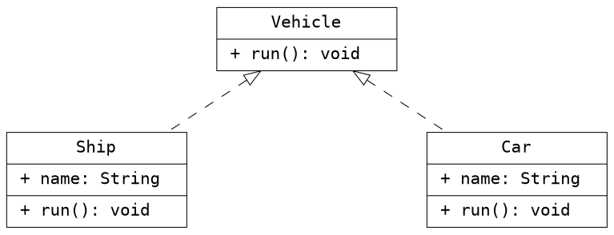

<font size=4>Graphiz是一款编码式的数据结构画图工具，下面讲一下CentOs下如何安装和使用这个工具。</font>

### 安装

#### 1、命令安装
`yum -y install graphviz`

#### 2、测试安装是否成功
`which dot`
显示：/usr/bin/dot
dot -v
```
dot - graphviz version 2.40.1 (0)
libdir = "/usr/lib64/graphviz"
Activated plugin library: libgvplugin_dot_layout.so.6
```

*以上，表示安装成功*

#### 3、作图命令
（1）在任意文件夹下创建test.dot
（2）输入代码并保存
（3）执行`dot -Tpng test.dot -o test.png`命令，即可生成test.png图片

#### 4、示例
（1）画一个表示继承的类图
```dot
digraph {
    graph [fontname="Inconsolata, Consolas", fontsize=10, penwidth=0.5,
        labeljust=center, dip=720]
    node [shape=record, fontname="Inconsolata, Consolas", fontsize=10, penwidth=    0.5]
    Taxi [label = "{Taxi | \l| \l}", width=1.5]
    Bus [label = "{Bus | \l| \l}", width=1.5]
    Car [label = "{Car| + name: String\l + drivers: Array\l |+ run(): void\l}", width=1.5]

    /* Unidirecitonal association */
    {
        edge [arrowhead=empty, label="继承", fontsize=10,  arrowtail=onormal, di r=back]
        Car -> { Bus, Taxi }
    }
}
```
效果展示：


（2）画一个表示实现关系的类图

效果展示：


#### 5、注意事项
（1）注意diamond属性只有当dir=back或者dir=both的时候才生效。类似的属性也需要注意使用条件。
